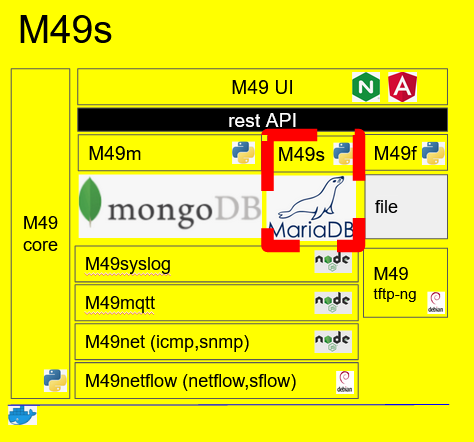

##M49s Docker Stack
- [] m49 network
docker network create --subnet 192.168.255.0/24 m49
- [] phpmyadmin 
docker run -d --network m49 -p 8089:80 --name phpmyadmin -e PMA_HOST=m49sql phpmyadmin
- [] m49sql 
docker run -d --network m49 -p 3306:3306 -e MYSQL_ROOT_PASSWORD=m49sql --name m49sql mariadb
docker cp .\server\ m49sql:/
docker exec -it m49sql bash /server/serverconfig.sh
docker stop m49sql
docker start m49sql
docker exec -it m49sql bash /server/createDB.sh
